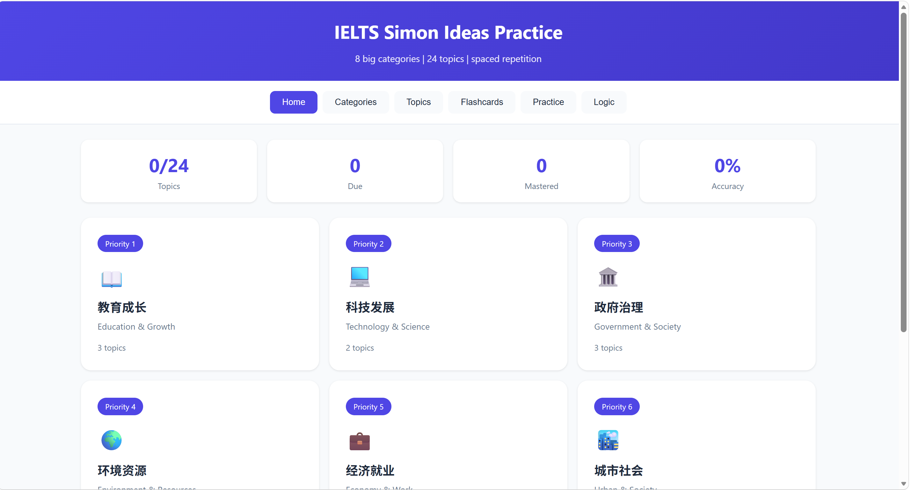
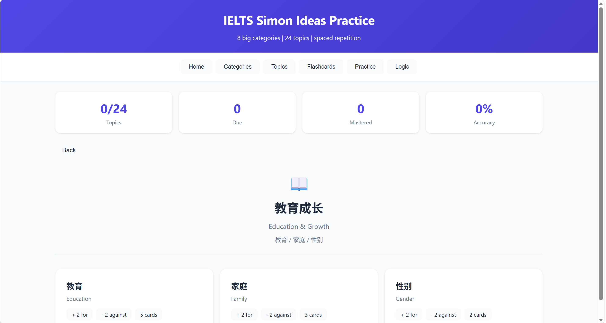
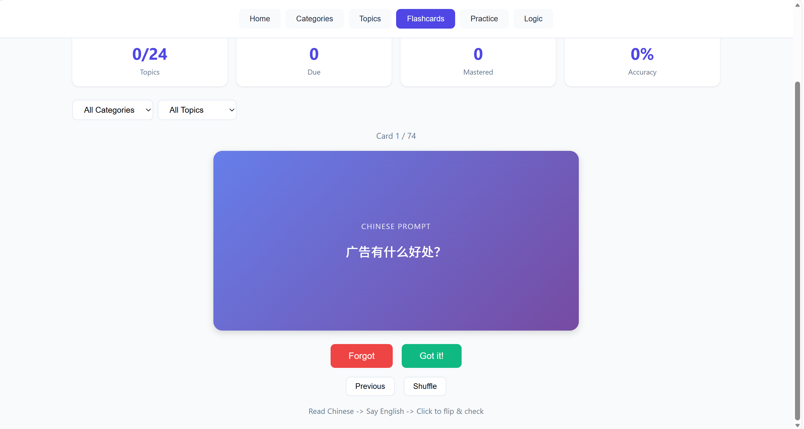
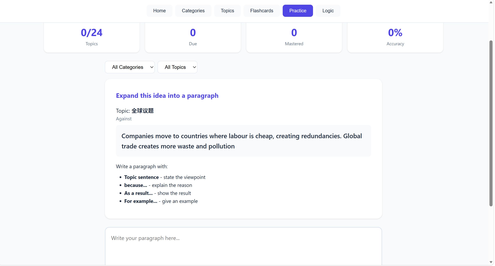
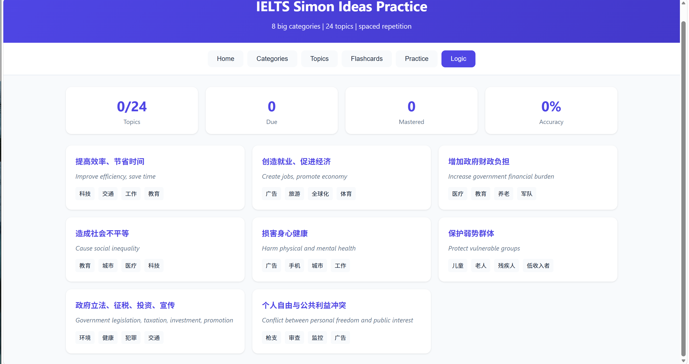
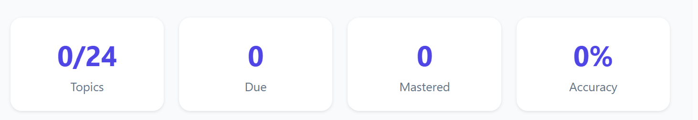

# 🎓 IELTS Simon Ideas Practice

> 基于 IELTS Simon 写作观点素材整理的交互式复习工具。
>
> 覆盖 **8 大类别、24 个话题、100 条正反观点、74 张中英闪卡和 8 条通用逻辑链**，支持观点浏览、闪卡复习、段落扩写与学习进度记录。

## ✨ 项目功能

| 功能 | 说明 |
|---|---|
| 📚 观点浏览 | 按类别和话题查看中英文观点，每个话题包含 For、Against 和 Opinion |
| 🗂️ 话题分类 | 按优先级整理 8 大类别，并提供 24 个话题的独立详情页 |
| 🃏 闪卡复习 | 先看中文提示，再翻转查看英文答案；可按类别或话题筛选，并支持随机打乱 |
| 🔁 间隔复习 | 根据掌握情况安排复习时间：当天、第 2 天、第 4 天、第 7 天、第 14 天 |
| ✍️ 写作练习 | 随机抽取一个正方或反方观点，按照固定逻辑框架扩写成完整段落 |
| 🧠 通用逻辑 | 提供 8 条可迁移到多个 IELTS 话题的通用论证链 |
| 📊 学习统计 | 显示已复习话题、待复习卡片、已掌握卡片和掌握率 |
| 💾 本地保存 | 闪卡复习记录保存在浏览器 `localStorage` 中，刷新页面后仍可保留 |

## 🖼️ 使用演示

### 1. 首页：八大类别



首页按优先级展示 8 大类别。点击类别卡片，可以查看该类别包含的全部话题。

### 2. 话题详情：For / Against / Opinion



每个话题包含：

- **For**：支持观点，中英文对照并标注关键词
- **Against**：反对观点，中英文对照并标注关键词
- **Opinion**：可用于形成个人立场的综合观点
- **Subtopics**：该主题下常见的细分写作方向

### 3. 闪卡复习



复习流程：

1. 阅读中文问题，尝试用英文作答；
2. 点击卡片翻面，查看英文参考答案；
3. 点击 `Got it!` 或 `Forgot` 记录掌握情况；
4. 系统根据复习次数更新下一次复习时间。

闪卡支持按类别、话题筛选，也可以点击 `Shuffle` 随机打乱。

### 4. 写作练习



系统会随机抽取一个观点，帮助你按照以下结构扩写段落：

```text
Topic sentence → Because → As a result → For example
```

页面内可以直接输入英文段落，并通过 `Show reference` 查看原始中英文观点。

### 5. 通用逻辑



项目内置 8 条高频论证逻辑，例如：

- 提高效率、节省时间
- 创造就业、促进经济
- 增加政府财政负担
- 造成社会不平等
- 损害身心健康
- 保护弱势群体
- 政府立法、征税、投资和宣传
- 个人自由与公共利益冲突

每条逻辑都标注了适用话题，便于在不同作文题目中迁移使用。

### 6. 学习统计



页面顶部会实时显示：

- **Topics**：已复习话题数 / 24
- **Due**：当前到期、需要复习的卡片数
- **Mastered**：复习达到设定次数的卡片数
- **Mastery**：已掌握卡片占已复习卡片的比例

## 📚 内容范围

所有观点按照项目中的实际数据划分为以下 8 类：

| # | 类别 | 话题数 | 包含话题 |
|---:|---|---:|---|
| 1 | 📖 教育成长 | 3 | Education、Family、Gender |
| 2 | 💻 科技发展 | 2 | TV, Internet & Phones、Genetic Engineering |
| 3 | 🏛️ 政府治理 | 3 | Crime、Government & Society、Guns & Weapons |
| 4 | 🌍 环境资源 | 3 | Environment、Water、Transport |
| 5 | 💼 经济就业 | 3 | Advertising、Work、Money & Consumerism |
| 6 | 🏙️ 城市社会 | 3 | Cities、Housing & Architecture、Global Issues |
| 7 | ❤️ 健康生活 | 3 | Health、Sport & Leisure、Personality |
| 8 | 🌐 文化交流 | 4 | Tourism、Language、Traditional vs Modern、Animal Rights |

合计：**8 个类别、24 个话题、50 条支持观点、50 条反对观点、74 张复习闪卡、8 条通用逻辑链。**

## 🚀 快速开始

### 方式一：直接在本地打开

1. 下载仓库中的 `ielts-practice-fix.html`；
2. 双击文件，使用浏览器打开；
3. 无需安装依赖，也无需启动服务器。

### 方式二：使用 GitHub Pages

1. 将项目上传到 GitHub 仓库；
2. 进入仓库的 `Settings` → `Pages`；
3. 在 **Build and deployment** 中选择 `Deploy from a branch`；
4. 分支选择 `main`，目录选择 `/ (root)`；
5. 保存后等待 GitHub Pages 完成部署。

## 📁 项目结构

```text
IELTS/
├── README.md
├── ielts-practice.html
└── images/
    ├── home.png
    ├── topic-detail.png
    ├── flashcard.png
    ├── practice.png
    ├── logic.png
    └── stats.png
```

其中，`ielts-practice.html` 已内嵌页面样式、交互逻辑和全部话题数据，是项目的核心文件。

## 💻 技术实现

- **原生前端**：使用 HTML、CSS 和 JavaScript，无第三方框架
- **单文件应用**：样式、脚本和 24 个话题的数据全部内嵌在一个 HTML 文件中
- **响应式布局**：适配桌面端和移动端浏览器
- **本地数据存储**：使用 `localStorage` 保存闪卡复习进度
- **无需后端**：可以直接本地运行，也可以部署到静态网站托管平台

## 🧩 学习建议

这个工具更适合用来记忆“观点与逻辑”，而不是逐字背诵完整答案。建议按照以下方式使用：

1. 先浏览一个话题的正反观点；
2. 用闪卡练习中文到英文的主动回忆；
3. 选择一个观点，用自己的语言解释原因、结果和例子；
4. 将通用逻辑迁移到相近话题；
5. 根据 Due 数量定期完成复习。

## 📖 内容来源与声明

本项目中的观点素材基于 **IELTS Simon** 的公开教学内容进行分类和学习化整理，主要用于个人 IELTS 写作复习与观点训练。

本项目并非 IELTS Simon 官方产品，也不代表 IELTS、British Council、IDP 或 Cambridge English 的官方立场。公开发布或二次分发时，请尊重原始教学内容及相关权利人的权益，避免将第三方教学素材整体声明为自己的原创内容。

## 📄 License

项目代码可根据仓库中的 `LICENSE` 文件进行使用和修改。第三方教学素材不当然适用代码许可证，其相关权利仍归原作者或权利人所有。
